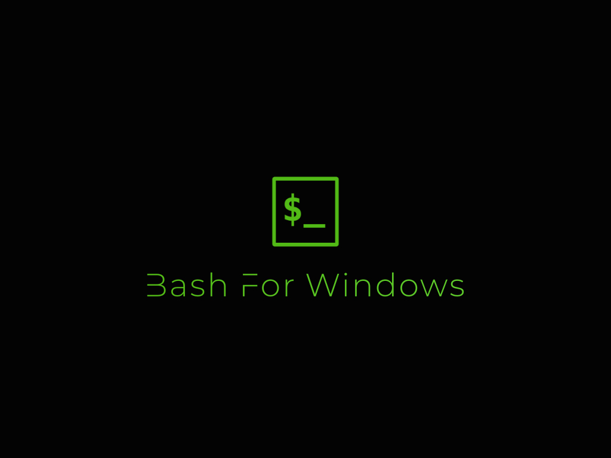
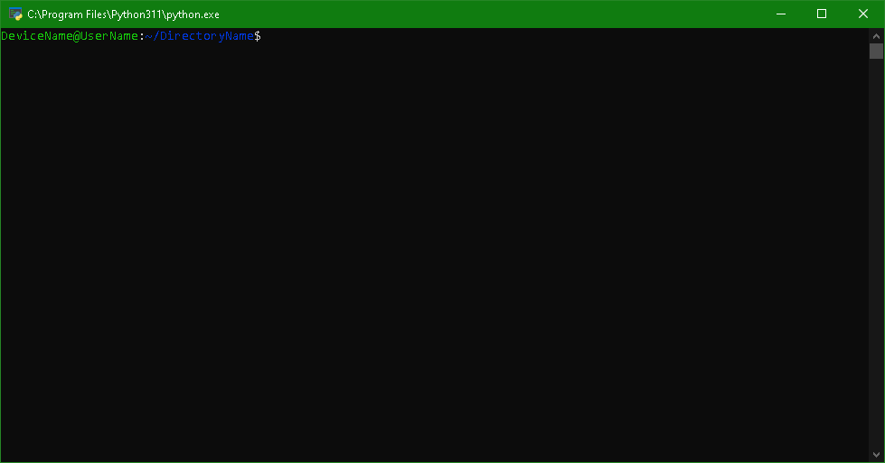

# Bash For Windows
It allows Windows users to use a bash-style cmd.

# required libraries
- os
- socket
- colorama
  - Installation command: `pip insall colorama`

# Usage
**start bash.py for use.**

**or start bash.py as an administrator.**

# Screenshot
